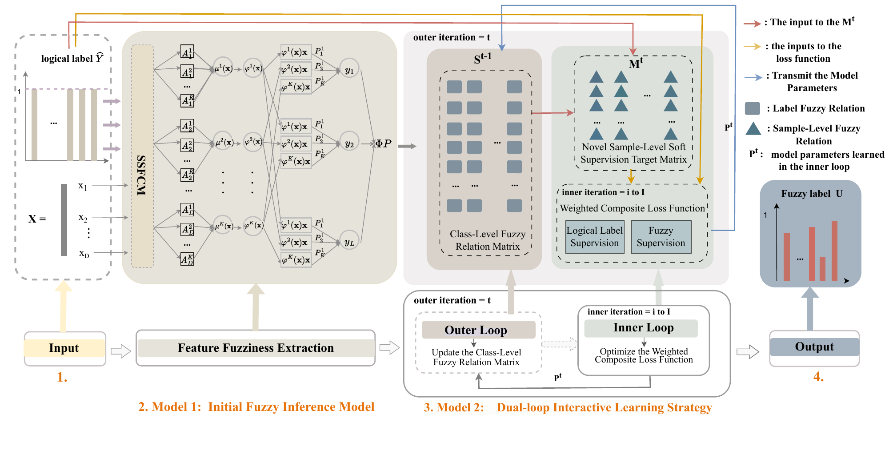

<h1 align="center">DL-FLGL</h1>
<p align="center"><strong>Dual-Loop Fuzzy Label Generation and Learning</strong></p>
<p align="center">Supervised subspace fuzzy clustering · TSK fuzzy inference · Dynamic fuzzy label learning</p>
<p align="center">
  <a href="#model-overview">Model Overview</a> ·
  <a href="#configuration">Configuration</a> ·
  <a href="#experiments">Experiments</a> ·
  <a href="#documentation">Documentation</a>
</p>

DL-FLGL jointly refines fuzzy supervision and model parameters through a dual-loop learning strategy. Supervised subspace fuzzy clustering constructs discriminative TSK rules, while class-level fuzzy relations guide the generation of sample-level soft supervision during training.

This repository provides the standalone core method for multi-label learning, including training, prediction, and five-fold evaluation.

## Model Overview

<p align="center">
  <a href="assets/Fig2.pdf"></a>
</p>
<p align="center"><em>Overall framework of DL-FLGL.</em> <a href="assets/Fig2.pdf">View the original PDF</a></p>

The framework comprises three components:

1. **Supervised subspace rule construction.** Candidate feature subspaces are evaluated using a label-purity criterion, and selected subspaces define the fuzzy antecedents.
2. **TSK fuzzy inference.** Gaussian memberships and additive rule activation construct the fuzzy dictionary and latent label responses.
3. **Dual-loop learning.** The outer loop updates class-level fuzzy relations and sample-level soft supervision. The inner loop optimizes consequent parameters using FISTA with label-structure, L2, and L1 regularization.

## Configuration

The implementation has been validated on CPU with the following environment:

| Component | Tested version |
|---|---|
| Python | 3.8.3 |
| PyTorch | 2.4.1+cpu |
| NumPy | 1.18.5 |
| SciPy | 1.5.0 |
| scikit-learn | 0.23.1 |

```bash
git clone https://github.com/ChenxiLuo-code1/DL-FLGL.git
cd DL-FLGL
python -m venv .venv
```

Activate the environment on Windows PowerShell:

```powershell
.\.venv\Scripts\Activate.ps1
```

Or on Linux/macOS:

```bash
source .venv/bin/activate
```

Install dependencies:

```bash
python -m pip install -r requirements.txt
```

The table records the tested local environment; `requirements.txt` allows version ranges rather than an exact environment lock. Fresh installations with other versions have not been verified. CUDA is optional: `--device cuda` runs consequent optimization on a compatible GPU, while antecedent construction remains on CPU. CUDA execution has not been validated in this release.

## Experiments

### 1. Quick start

Run five-fold evaluation on a locally generated synthetic dataset:

```bash
python run.py --demo --config configs/example.json --output outputs/demo.json
```

No dataset download is required for this example.

### 2. Prepare data

Place a dataset in `data/`, or pass its local path through `--data`. Datasets are not bundled with the repository.

| Format | Features | Logical labels |
|---|---|---|
| `.mat` | `data`, `X`, or `features` | `target`, `Y`, or `labels` |
| `.npz` | `X` | `Y` |

Features use shape **N × D** and labels preferably use **N × L**. Labels encoded as -1 are converted to 0. See [data preparation notes](data/README.md) for supported layouts and limitations.

### 3. Train and evaluate

For example, after providing `data/flags.mat`:

```bash
python run.py --data data/flags.mat --config configs/validation_flags.json --output outputs/flags.json
```

This runs five folds with fixed parameters. Min-max scaling is fitted independently on each training fold. The output JSON records fold indices, configuration, selected subspaces, objective histories, convergence diagnostics, and the mean and sample standard deviation of:

| Metric | Description | Direction |
|---|---|---|
| AP | Average Precision | Higher is better |
| HL | Hamming Loss | Lower is better |
| OE | One Error | Lower is better |
| RL | Ranking Loss | Lower is better |
| CV | Normalized Coverage | Lower is better |

Useful options include `--seed 42`, `--folds 5`, `--threads 1`, and `--device cpu`.

### 4. Predict with the Python API

```python
from sklearn.preprocessing import MinMaxScaler
from dl_flgl import Config, DLFLGL

# Supply X_train[N,D], Y_train[N,L], and X_test[N_test,D].
scaler = MinMaxScaler().fit(X_train)
model = DLFLGL(Config()).fit(scaler.transform(X_train), Y_train)

X_test_scaled = scaler.transform(X_test)
scores = model.decision_function(X_test_scaled)      # latent responses
memberships = model.predict_membership(X_test_scaled)  # bounded in [0, 1]
labels = model.predict(X_test_scaled)               # threshold = 0.5
```

### 5. Verify the implementation

```bash
python -m unittest discover -s tests -v
```

Nine tests cover label impurity, Gaussian widths, relation orientation and clipping, PSD projection, gradient correctness, FISTA, deterministic training, evaluation metrics, and parameter validation. Synthetic and Flags five-fold checks are documented in the [validation report](docs/validation.md).

## Parameters

| Parameter | Meaning |
|---|---|
| `B`, `B_prime` | Candidate and selected subspace counts |
| `C` | Clusters per selected subspace; total rules K = C × B_prime |
| `M` / `M_fraction` | Explicit subspace dimension or fraction used to compute ceil(fraction × D) |
| `m`, `h` | FCM fuzzifier and Gaussian width scale |
| `alpha` | Balance between logical-label and soft-supervision losses |
| `beta1`, `beta2`, `beta3` | Label-structure, L2, and L1 regularization strengths |
| `num_epochs` | Outer-loop iteration budget |
| `maxIter` | Inner-loop iteration budget |
| `minimumLossMargin` | Proximal residual tolerance |

`configs/example.json` provides demonstration settings. `configs/validation_flags.json` increases the inner budget for the Flags convergence check. Neither configuration is claimed to contain the manuscript's dataset-optimal hyperparameters.

## Repository Structure

```text
DL-FLGL/
├── assets/             # Framework image and original PDF
├── configs/            # Example and validation configurations
├── data/               # Data preparation instructions
├── dl_flgl/            # Core model, optimization, data I/O, and metrics
├── docs/               # Formula mapping, provenance, and validation
├── tests/              # Mathematical and execution checks
├── requirements.txt
└── run.py              # Five-fold evaluation entry point
```

## Documentation

- [Manuscript-to-code correspondence](docs/manuscript_alignment.md)
- [Validation report](docs/validation.md)
- [Source provenance](docs/source_manifest.json)
- [Data preparation](data/README.md)

This core release follows Section 3 of the revised manuscript. Its formula corrections and numerical conventions are documented explicitly. The validation results are execution and correctness checks, **not reproduction of the manuscript's reported benchmark tables**. The 100-trial hyperparameter search, baseline comparisons, and full nine-dataset experiments are not included.

The dense fuzzy dictionary and label-relation eigendecomposition can require substantial memory and computation for large feature or label spaces. Budget exhaustion is recorded in the convergence diagnostics.
